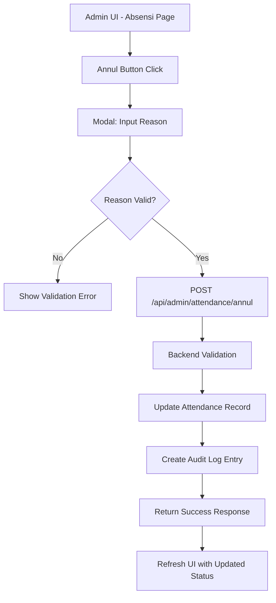

# Design Document: Attendance Annulment

## Overview

Fitur Anulir Absensi memungkinkan admin untuk membatalkan record absensi staff tanpa menghapus data secara permanen. Implementasi menggunakan pendekatan soft delete dengan menambahkan field status dan metadata anulir pada tabel attendance. Fitur ini terintegrasi dengan sistem audit log yang sudah ada.

## Architecture



## Components and Interfaces

### 1. Database Layer

**Modified Table: attendance**
- Tambah kolom `status` dengan default 'active'
- Tambah kolom `annulled_by` untuk menyimpan admin ID
- Tambah kolom `annulled_at` untuk timestamp anulir
- Tambah kolom `annulled_reason` untuk alasan anulir

### 2. API Layer

**New Endpoint: POST /api/admin/attendance/annul**
```typescript
interface AnnulRequest {
  attendance_id: number;
  reason: string;
}

interface AnnulResponse {
  success: boolean;
  message: string;
}
```

**Modified Endpoint: GET /api/attendance/all**
- Tambah field status, annulled_by, annulled_at, annulled_reason di response
- Tambah query parameter `include_annulled` (default: true)

### 3. UI Layer

**Modified: public/admin/absensi.html**
- Tambah kolom "Aksi" dengan tombol "Anulir" untuk setiap record aktif
- Tambah modal konfirmasi dengan input alasan
- Visual distinction untuk record yang sudah dianulir (strikethrough, badge)
- Filter toggle untuk show/hide annulled records

## Data Models

### Attendance Record (Updated)
```typescript
interface AttendanceRecord {
  id: number;
  user_id: number;
  type: 'in' | 'out';
  timestamp: string;
  lat: number | null;
  lng: number | null;
  status: 'active' | 'annulled';
  annulled_by: number | null;
  annulled_at: string | null;
  annulled_reason: string | null;
}
```

### Audit Log Entry
```typescript
interface AuditLogEntry {
  id: number;
  user_id: number;
  action: string;
  detail: string; // JSON string containing attendance data and reason
  created_at: string;
}
```

## Correctness Properties

*A property is a characteristic or behavior that should hold true across all valid executions of a system-essentially, a formal statement about what the system should do. Properties serve as the bridge between human-readable specifications and machine-verifiable correctness guarantees.*

### Property 1: Annulment preserves original data
*For any* attendance record that is annulled, the original attendance data (user_id, type, timestamp, lat, lng) SHALL remain unchanged after annulment.
**Validates: Requirements 1.4**

### Property 2: Annulment requires valid reason
*For any* annulment request, if the reason is empty or whitespace-only, the system SHALL reject the request and the attendance record status SHALL remain unchanged.
**Validates: Requirements 1.3**

### Property 3: Annulled records excluded from count
*For any* payroll calculation, the count of attendance records SHALL equal the count of records where status is 'active', excluding all records where status is 'annulled'.
**Validates: Requirements 3.1**

### Property 4: Annulment creates audit trail
*For any* successful annulment operation, there SHALL exist exactly one corresponding audit log entry containing the attendance_id, admin_id, and reason.
**Validates: Requirements 4.1**

### Property 5: Only admin can annul
*For any* annulment request from a non-admin user, the system SHALL reject the request with 403 status and the attendance record SHALL remain unchanged.
**Validates: Requirements 1.1**

## Error Handling

| Error Case | HTTP Status | Message |
|------------|-------------|---------|
| Missing attendance_id | 400 | "ID absensi wajib diisi" |
| Missing/empty reason | 400 | "Alasan anulir wajib diisi" |
| Attendance not found | 404 | "Record absensi tidak ditemukan" |
| Already annulled | 400 | "Record sudah dianulir sebelumnya" |
| Non-admin user | 403 | "Hanya admin yang dapat melakukan anulir" |
| Database error | 500 | "Terjadi kesalahan sistem" |

## Testing Strategy

### Unit Tests
- Validasi input reason (empty, whitespace, valid)
- Validasi attendance_id exists
- Validasi status transition (active -> annulled)
- Validasi double annulment prevention

### Property-Based Tests
- **Library**: fast-check (sudah digunakan di project)
- **Minimum iterations**: 100

Property tests akan menggunakan format:
```
**Feature: attendance-annulment, Property {number}: {property_text}**
```

1. **Property 1 Test**: Generate random attendance records, annul them, verify original data unchanged
2. **Property 2 Test**: Generate random strings including empty/whitespace, verify rejection for invalid reasons
3. **Property 3 Test**: Generate random mix of active/annulled records, verify count excludes annulled
4. **Property 4 Test**: Generate random annulment operations, verify audit log entries created
5. **Property 5 Test**: Generate requests with various roles, verify only admin succeeds

### Integration Tests
- Full flow: create attendance -> annul -> verify status -> verify audit log
- API endpoint authorization tests
- UI interaction tests (optional)
