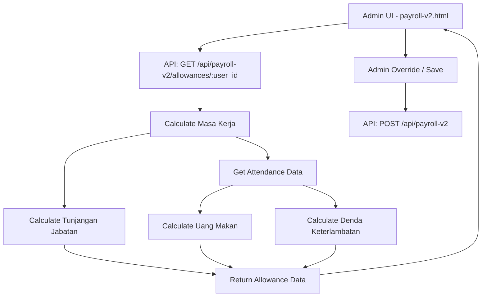

# Design Document: Payroll Allowance Rules

## Overview

Fitur ini menambahkan perhitungan otomatis untuk tunjangan jabatan, uang makan, dan denda keterlambatan berdasarkan masa kerja dan data absensi karyawan. Sistem akan menggunakan `join_date` dari tabel users untuk menghitung masa kerja, kemudian menerapkan formula yang sesuai untuk menentukan nilai tunjangan jabatan dan rate uang makan. Selain itu, sistem akan menghitung denda keterlambatan berdasarkan waktu absen masuk dibandingkan dengan jam masuk shift.

## Architecture



## Components and Interfaces

### 1. Database Schema Changes

**Migration: Add join_date to users table**

```sql
ALTER TABLE users ADD COLUMN join_date TEXT;
```

### 2. API Endpoints

#### GET /api/payroll-v2/allowances/:user_id
Menghitung tunjangan jabatan dan uang makan otomatis.

**Query Parameters:**
- `month` (required): Bulan payroll (1-12)
- `year` (required): Tahun payroll

**Response:**
```json
{
  "user_id": 1,
  "name": "John Doe",
  "join_date": "2023-01-15",
  "masa_kerja_bulan": 23,
  "attendance_count": 26,
  "tunjangan_jabatan": 150000,
  "tunjangan_jabatan_formula": "Masa kerja 23 bulan (>12 bulan): Rp 150.000",
  "uang_makan_rate": 20000,
  "uang_makan_total": 520000,
  "uang_makan_formula": "26 hari x Rp 20.000 (masa kerja >12 bulan)",
  "late_count": 3,
  "denda_per_late": 25000,
  "denda_total": 75000,
  "denda_formula": "3 hari terlambat x Rp 25.000"
}
```

#### GET /api/payroll-v2 (Updated)
Menambahkan field `join_date` dan `masa_kerja_bulan` di response.

### 3. Calculation Logic

#### Tunjangan Jabatan Formula

```typescript
function calculateTunjanganJabatan(masaKerjaBulan: number): number {
  if (masaKerjaBulan <= 12) {
    return 0;
  }
  
  // Setelah 12 bulan pertama, dapat 150rb
  // Setiap 12 bulan berikutnya, +100rb
  const periodsAfterFirst = Math.floor((masaKerjaBulan - 1) / 12);
  
  if (periodsAfterFirst === 1) {
    return 150000; // 13-24 bulan
  }
  
  // 25+ bulan: 150rb + (periods - 1) * 100rb
  return 150000 + (periodsAfterFirst - 1) * 100000;
}
```

**Contoh Perhitungan:**
| Masa Kerja | Periods | Tunjangan |
|------------|---------|-----------|
| 0-12 bulan | 0 | Rp 0 |
| 13-24 bulan | 1 | Rp 150.000 |
| 25-36 bulan | 2 | Rp 250.000 |
| 37-48 bulan | 3 | Rp 350.000 |

#### Uang Makan Formula

```typescript
function calculateUangMakanRate(masaKerjaBulan: number): number {
  return masaKerjaBulan > 12 ? 20000 : 17000;
}

function calculateUangMakan(masaKerjaBulan: number, attendanceCount: number): number {
  const rate = calculateUangMakanRate(masaKerjaBulan);
  return rate * attendanceCount;
}
```

#### Denda Keterlambatan Formula

```typescript
// Shift configuration
const SHIFT_CONFIG = {
  pagi: { startHour: 7, startMinute: 0 },   // 07:00 WITA
  sore: { startHour: 14, startMinute: 0 }   // 14:00 WITA
};

const LATE_TOLERANCE_MINUTES = 15;
const DENDA_PER_LATE = 25000;

function isLate(clockInTime: Date, shift: 'pagi' | 'sore'): boolean {
  const shiftStart = SHIFT_CONFIG[shift];
  const clockInMinutes = clockInTime.getHours() * 60 + clockInTime.getMinutes();
  const shiftStartMinutes = shiftStart.startHour * 60 + shiftStart.startMinute;
  const toleranceMinutes = shiftStartMinutes + LATE_TOLERANCE_MINUTES;
  
  return clockInMinutes > toleranceMinutes;
}

function calculateDenda(lateCount: number): number {
  return lateCount * DENDA_PER_LATE;
}
```

#### Masa Kerja Calculation

```typescript
function calculateMasaKerja(joinDate: string, payrollMonth: number, payrollYear: number): number {
  const join = new Date(joinDate);
  const payroll = new Date(payrollYear, payrollMonth - 1, 1);
  
  const months = (payroll.getFullYear() - join.getFullYear()) * 12 
                 + (payroll.getMonth() - join.getMonth());
  
  return Math.max(0, months);
}
```

### 4. Attendance Queries

**Attendance Count Query:**
```sql
SELECT COUNT(DISTINCT DATE(timestamp)) as attendance_count
FROM attendance
WHERE user_id = ?
  AND type = 'in'
  AND strftime('%Y-%m', timestamp) = ?
```

**Late Count Query (for shift pagi - 07:00):**
```sql
SELECT COUNT(*) as late_count
FROM attendance
WHERE user_id = ?
  AND type = 'in'
  AND shift = 'pagi'
  AND strftime('%Y-%m', timestamp) = ?
  AND CAST(strftime('%H', timestamp) AS INTEGER) * 60 + CAST(strftime('%M', timestamp) AS INTEGER) > (7 * 60 + 15)
```

**Late Count Query (for shift sore - 14:00):**
```sql
SELECT COUNT(*) as late_count
FROM attendance
WHERE user_id = ?
  AND type = 'in'
  AND shift = 'sore'
  AND strftime('%Y-%m', timestamp) = ?
  AND CAST(strftime('%H', timestamp) AS INTEGER) * 60 + CAST(strftime('%M', timestamp) AS INTEGER) > (14 * 60 + 15)
```

## Data Models

### User (Updated)
```typescript
interface User {
  id: number;
  name: string;
  email: string;
  password_hash: string;
  role: 'admin' | 'gudang' | 'produksi';
  outlet_id: number | null;
  join_date: string | null;  // NEW: Format YYYY-MM-DD
  created_at: string;
}
```

### AllowanceCalculation
```typescript
interface AllowanceCalculation {
  user_id: number;
  name: string;
  join_date: string | null;
  masa_kerja_bulan: number;
  attendance_count: number;
  tunjangan_jabatan: number;
  tunjangan_jabatan_formula: string;
  uang_makan_rate: number;
  uang_makan_total: number;
  uang_makan_formula: string;
  late_count: number;
  denda_per_late: number;
  denda_total: number;
  denda_formula: string;
}
```

### ShiftConfig
```typescript
interface ShiftConfig {
  pagi: { startHour: number; startMinute: number };
  sore: { startHour: number; startMinute: number };
}
```

## Error Handling

| Scenario | HTTP Status | Response |
|----------|-------------|----------|
| Missing month/year parameter | 400 | `{ "message": "Parameter month dan year wajib" }` |
| User not found | 404 | `{ "message": "User tidak ditemukan" }` |
| Join date not set | 400 | `{ "message": "Join date belum diatur untuk user ini" }` |

## Testing Strategy

### Unit Tests
1. Test `calculateTunjanganJabatan` dengan berbagai masa kerja
2. Test `calculateUangMakanRate` untuk threshold 12 bulan
3. Test `calculateMasaKerja` dengan berbagai kombinasi tanggal

### Integration Tests
1. Test endpoint `/api/payroll-v2/allowances/:user_id` dengan user yang memiliki join_date
2. Test endpoint dengan user tanpa join_date (expect error)
3. Test perhitungan attendance count dari database

## UI Changes (payroll-v2.html)

### Form Edit Payroll
Tambahkan tombol "Hitung Otomatis" di samping field tunjangan jabatan dan uang makan:

```html
<div>
  <label class="block text-xs text-slate-600 mb-1">Tunjangan Jabatan</label>
  <div class="flex gap-1">
    <input type="number" id="tunjangan_jabatan" class="flex-1 rounded border px-2 py-1 text-sm" />
    <button type="button" onclick="calcAllowances()" class="text-[10px] bg-accent text-white px-2 rounded">Auto</button>
  </div>
  <p id="tunjangan-info" class="text-[10px] text-slate-500 mt-1"></p>
</div>

<div>
  <label class="block text-xs text-slate-600 mb-1">Uang Makan</label>
  <div class="flex gap-1">
    <input type="number" id="uang_makan" class="flex-1 rounded border px-2 py-1 text-sm" />
  </div>
  <p id="uangmakan-info" class="text-[10px] text-slate-500 mt-1"></p>
</div>
```

### Display Info
Tampilkan informasi masa kerja dan formula perhitungan setelah klik "Auto":
- "Masa kerja: 23 bulan"
- "Tunjangan: Rp 150.000 (>12 bulan)"
- "Uang makan: 26 hari x Rp 20.000 = Rp 520.000"
- "Denda: 3 hari terlambat x Rp 25.000 = Rp 75.000"

### Denda Field
```html
<div>
  <label class="block text-xs text-slate-600 mb-1">Denda Keterlambatan</label>
  <div class="flex gap-1">
    <input type="number" id="denda_terlambat" class="flex-1 rounded border px-2 py-1 text-sm" readonly />
  </div>
  <p id="denda-info" class="text-[10px] text-slate-500 mt-1"></p>
</div>
```
